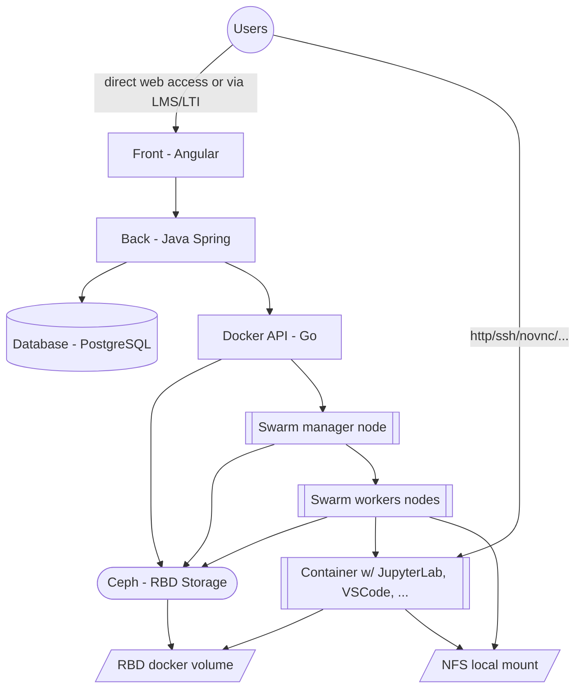

# MyDocker - CentraleSupélec's virtual lab platform
A scalable virtual labs provider based on Docker with simple integration to your LMS (Learning Management System).

## Description
Easily give your students access to hundreds of labs based on Docker, directly from your LMS (such as Moodle) in a scalable infrastructure.

With MyDocker :
- you are free to schedule labs whenever you want (by using cloud computing resourses), and free to update you labs' environements without having to ask support from the IT team (your environements are indepedent from others and thus will not cause any conflict)
- you give access to the same lab environement with the same performance to the students
- you keep your students data private and do not leak personnal information

## Project architecture

The project is splitted between multiple directories :

- [**front**](front) : The static website frontend, built with Angular
- [**back**](back) : The backend retrieving data from the database, and calling the project's Docker API with Protobuf
- [**docker-api**](docker-api) : The custom API server written in Go, wich call the native Docker api
- [**volume-plugin**](volume-plugin) : A fork from the [wetopi docker volume plugin for rbd](https://github.com/wetopi/docker-volume-rbd) enhanced to support either local filesystem or rbd storage

## Diagram

## Documentation

The documentation is available on our [Github project's page](https://centralesupelec.github.io/mydocker).

To edit the documentation, you can serve it localy : `docker run --rm -it -p 8000:8000 -v ${PWD}:/docs squidfunk/mkdocs-material`

The Github's CI will deploy it once merged.
